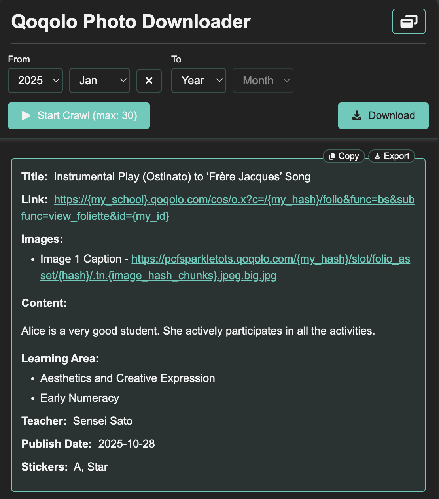
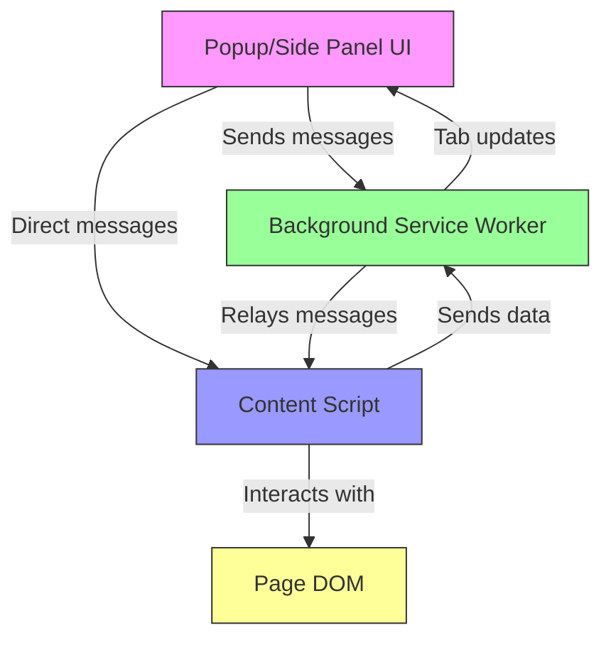

# Qoqolo Photo Downloader Chrome Extension

A Chrome (Manifest V3) extension written in TypeScript to crawl and organize photos from Qoqolo, a school-parent platform developed by CommonTown.

Refer to the [User README](./README_USER.md) if you simply wish to use this extension in Google Chrome.

## Disclaimer

### With Qoqolo

This plugin is to meet my own needs for retrieving and organizing photos from the platform for my children.

This plugin is not affiliated with Qoqolo, CommonTown or any school.

### AI

This document is partially generated with AI.

The code is mostly done via Vibe Coding, although all code is curated.

### Privacy

There is zero server communication for this plugin. It retrieves data based on what you, as a human, may see when entering a page. In technical terms, it is done via parsing the DOM and extracting text from DOM content.

## Functionalities

### Portfolio Activities Extraction (Implemented)

Extracts portfolio activities from the **Portfolios > Activity > Recent** page with date range filtering, real-time crawling, and comprehensive data extraction (images, content, metadata). Supports individual item copy/export and batch download as ZIP files. Includes session expiry detection, logo extraction, and dual popup/side panel view modes.

### Class Activity Extraction (Implemented)

Extracts class activity posts directly from the Class Activity page without requiring modal interactions. Features date range filtering, real-time crawling, and comprehensive data extraction (images, content, teacher, publish date). Supports individual item copy/export and batch download as ZIP files. All item information is available directly on the page, making crawling faster than Portfolio extraction.

### Screenshot



The extension UI showing the Portfolio page interface with date range selectors, crawl controls, and extracted portfolio item details.

### Planned Functionalities

- Check-in / check-out photos extraction

## Tech Stack

- Chrome Extension (Manifest V3)
- TypeScript 5
- React 18
- Vite 5
- pnpm
- Font Awesome (React)
- JSZip (for ZIP file generation)
- ESLint + Prettier
- Sass/SCSS

## Prerequisites

- **Node.js ≥ 20** (recommended: latest LTS via `nvm`. Development is done with v25.2.1)
- **pnpm ≥ 10** (Development is done with v10.25.0)
- **Chrome ≥ 114**

---

## Getting Started

### Install dependencies

This project uses pnpm 10.25.0.

If you don't have pnpm installed, enable Corepack:

```bash
corepack enable
corepack prepare pnpm@10.25.0 --activate
```

```bash
pnpm install
```

pnpm blocks some dependency build scripts by default for security.

You must approve `esbuild` (required by Vite), if you are prompted to do so:

```bash
pnpm approve-builds
```

This is safe and expected. Vite will not work correctly without this step.

### Development

Build the extension (watch mode)

```bash
pnpm dev
```

or one-time build:

```bash
pnpm build
```

Build output will be in: `dist/`.

### Load the Extension in Chrome

- Open chrome://extensions

- Enable Developer Mode (top right)

- Click Load unpacked

- Select the dist/ folder

## Project Structure

```
.
├─ public/
│  └─ manifest.json       # Chrome extension manifest (MV3)
├─ src/
│  ├─ content/            # Content scripts
│  │  ├─ index.ts         # Main content script entry
│  │  ├─ portfolio/       # Portfolio page crawling logic
│  │  │  ├─ index.ts      # Portfolio message handler
│  │  │  └─ helpers/      # Crawling helpers (collectItems, handleCrawlItem, etc.)
│  │  └─ classActivity/   # Class Activity page crawling logic
│  │     ├─ index.ts      # Class Activity message handler
│  │     └─ helpers/      # Crawling helpers (collectItems, extractItemDetails)
│  ├─ background/         # Background service worker
│  │  ├─ index.ts         # Main background entry
│  │  ├─ constants.ts     # Background constants
│  │  ├─ state.ts         # Global state management
│  │  ├─ helpers/         # Helper functions
│  │  └─ listeners/       # Event listeners (onMessage, onUpdated, etc.)
│  ├─ popup/              # Extension UI (React)
│  │  ├─ index.html       # HTML entry point
│  │  ├─ main.tsx         # React entry point
│  │  ├─ App.tsx          # Main app component
│  │  ├─ PanelWrapper/    # Common UI wrapper with toggle button
│  │  ├─ Portfolio/       # Portfolio page UI
│  │  ├─ ClassActivity/   # Class Activity page UI
│  │  ├─ activityShared/  # Shared components/hooks for Portfolio and Class Activity
│  │  ├─ helpers/         # Popup helper functions
│  │  └─ styles/          # Global styles
│  └─ shared/             # Shared code
│     ├─ enums.ts         # Signal enums
│     ├─ types/           # TypeScript types
│     ├─ helpers/          # Shared helper functions
│     └─ utils/            # Utility functions (e.g., date formatting)
├─ dist/                  # Build output (load this in Chrome)
└─ .vscode/                # Shared editor settings
```

---

## Chrome Extension Architecture (src folder)

```
Popup <--> Background <--> Content Script <--> Page DOM
```

This project follows the standard Chrome Extension (Manifest V3) structure. Here's a brief overview of the key folders in `src/`:

| Folder        | Purpose                                                                                                                                                                                                                                                                                                                                                                                                                             |
| ------------- | ----------------------------------------------------------------------------------------------------------------------------------------------------------------------------------------------------------------------------------------------------------------------------------------------------------------------------------------------------------------------------------------------------------------------------------- |
| `content/`    | **Content scripts** run inside the web page context. They can read and manipulate the DOM, click links, and access page content. Contains page-specific crawling logic: `portfolio/` for Portfolio pages (with modal processing) and `classActivity/` for Class Activity pages (direct DOM extraction). Both include modular helpers for item collection and data extraction.                                                       |
| `background/` | **Background service worker** runs independently of any page. Handles tab state management, messaging coordination, view mode preferences, and logo URL storage. Organized into `helpers/` and `listeners/` subfolders for better code organization.                                                                                                                                                                                |
| `popup/`      | **React-based extension UI** (popup and side panel). Contains `App.tsx` as the main component, `PanelWrapper/` for common UI with toggle functionality and logo display, `Portfolio/` and `ClassActivity/` for page-specific UIs, and `activityShared/` for shared components/hooks used by both. All pages feature date filtering, crawl controls, and export functionality. Uses React hooks and components for state management. |
| `shared/`     | **Shared code** including type definitions (`types/`), signal enums (`enums.ts`), helper functions (`helpers/`), utility functions (`utils/`), and reusable components (e.g., `CrawlActionsBar`). Ensures type safety and code reuse across content scripts, background, and popup.                                                                                                                                                 |

In Chrome Extension MV3, the **content script** interacts with the page, the **background script** manages persistent logic and messaging, and the **popup** is the user-facing interface. The extension supports both popup and side panel views, with a toggle button to switch between them. Using `shared/` for types and common helpers ensures consistency across these parts.

### Chrome Extension Flow (Mermaid)

The relationships between the extension parts can be visualized like this:



**Explanation:**

- **Popup → Background**: Popup UI sends messages for view mode toggles, tab info requests (including logo extraction), and preference management.
- **Popup → Content Script**: Popup can send messages directly to content scripts (e.g., start/stop crawling with date range filters) via `chrome.tabs.sendMessage()`.
- **Background → Popup**: Background notifies popup about tab updates, state changes, and logo URL updates via `chrome.runtime.sendMessage()`.
- **Background → Content Script**: Background can relay messages or handle cross-tab communication. Also extracts logo from content script when on Qoqolo sites.
- **Content Script → Background**: Content script sends crawl results, status updates, and logo URLs to background, which forwards to popup.
- **Content Script → Page DOM**: Content script reads and modifies the web page, clicks links, waits for modals, extracts portfolio data (images, content, metadata), detects session expiry, and extracts logo from navbar.
